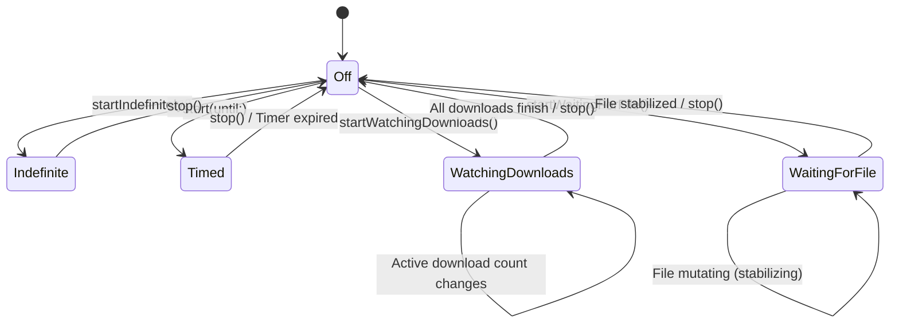

# WakeUpNeo: System Architecture & Technical Specification

## 1. System Overview

**WakeUpNeo** is a native macOS menu bar utility engineered to prevent system, display, and lid-close idle sleep during critical foreground and background tasks. Built entirely in Swift 6 and SwiftUI, it incorporates an intelligent **Smart Watchers** subsystem that automatically monitors in-flight downloads and long-running file exports, releasing power assertions as soon as tasks complete.

```
┌─────────────────────────────────────────────────────────────────────────┐
│                           SwiftUI Application Shell                     │
│               (MenuBarExtra, CountdownView, SettingsView)               │
└────────────────────────────────────┬────────────────────────────────────┘
                                     │ User Actions & State Bindings
                                     ▼
┌─────────────────────────────────────────────────────────────────────────┐
│                        SleepManager (@MainActor)                        │
│                 Central Coordinator & Observable State Owner            │
└──────────────┬───────────────────────────────────────────┬──────────────┘
               │                                           │
               ▼                                           ▼
┌──────────────────────────────┐            ┌──────────────────────────────┐
│    CompositeSleepService     │            │    FileWatchingService       │
│  (IOKit Power Assertions)    │            │  (DispatchSource + Polling)  │
├──────────────────────────────┤            ├──────────────────────────────┤
│ • Prevent System Sleep       │            │ • DownloadPatternMatcher     │
│ • Prevent Display Sleep      │            │ • FileStabilityChecker       │
│ • Prevent Lid-Close Sleep    │            │ • Settle Window Evaluation   │
└──────────────┬───────────────┘            └──────────────┬───────────────┘
               │                                           │
               │               Automatic Release           │
               └───────────────────────────────────────────┘
                                     │
                                     ▼
                    [ Native Notification Service ]
```

---

## 2. Target & Module Architecture

The codebase is partitioned into three isolated, decoupled targets to guarantee testability and enforce strict separation of concerns:

```
Sources/
├── WakeUpNeoCore/                  # Pure domain & infrastructure (No SwiftUI)
│   ├── Infrastructure/
│   │   ├── PowerAssertion.swift    # IOKit IOPMAssertion RAII wrapper
│   │   └── SleepManager.swift      # Central @Observable @MainActor coordinator
│   ├── Models/
│   │   ├── AppSettings.swift       # Preferences & UserDefaults persistence
│   │   └── SleepMode.swift         # State machine (.off, .indefinite, .timed, .watchingDownloads, .waitingForFile)
│   └── Services/
│       ├── AppLogger.swift         # Unified OSLog subsystem (com.wakeupneo.app)
│       ├── DefaultFileWatcherService.swift  # DispatchSource + Polling file monitor
│       ├── DownloadPatternMatcher.swift     # High-performance extension classifier
│       ├── FileStabilityChecker.swift       # Timestamp & size stabilization algorithm
│       ├── FileWatchingService.swift        # Protocol contracts & Sendable state types
│       ├── LaunchAtLoginService.swift       # SMAppService integration
│       ├── NotificationService.swift       # UNUserNotificationCenter alerts
│       └── SleepPreventionService.swift     # IOKit & ProcessInfo implementations
│
└── WakeUpNeo/                      # Native SwiftUI application shell
    ├── App/
    │   ├── WakeUpNeoApp.swift      # @main MenuBarExtra & Settings scenes
    │   └── AppEnvironment.swift    # App-level dependency container
    ├── Features/
    │   ├── MenuBar/
    │   │   ├── MenuBarView.swift   # Main popover interface
    │   │   ├── MenuBarIcon.swift   # Menu bar status icon
    │   │   └── CountdownView.swift # Real-time drift-free countdown
    │   └── Settings/
    │       ├── SettingsView.swift  # TabView settings window
    │       ├── GeneralSettingsView.swift
    │       ├── MonitoringSettingsView.swift
    │       ├── PowerSettingsView.swift
    │       └── AboutView.swift
    └── Resources/
        ├── AppIcon.icns            # macOS native application icon
        ├── WakeUpNeo-Info.plist    # LSUIElement=YES (hides Dock & Cmd+Tab)
        └── WakeUpNeo.entitlements  # Sandboxing & power entitlements
```

### Module Responsibilities

1. **`WakeUpNeoCore` (Framework Target)**:
   - Contains all domain logic, state machines, and low-level system integrations.
   - Strictly decoupled from SwiftUI (`import SwiftUI` is forbidden in `WakeUpNeoCore`).
   - 100% testable via unit and mock tests.
2. **`WakeUpNeo` (Executable App Target)**:
   - SwiftUI presentation layer managing popovers, menu bar controls, settings scenes, and AppKit bridges (e.g. `FilePickerHelper`).
   - Uses `LSUIElement = YES` in `Info.plist` to operate purely as an accessory utility (no Dock icon, no `Cmd+Tab` switcher presence).
3. **`WakeUpNeoTests` (Test Suite Target)**:
   - 203 automated tests spanning unit, adversarial, boundary, concurrency, and real-world end-to-end integration scenarios.

---

## 3. Concurrency & Threading Model

WakeUpNeo is engineered under **Swift 6 strict concurrency (`SWIFT_STRICT_CONCURRENCY = complete`)**:

- **MainActor Isolation**: UI coordination and observable state updates (`SleepManager`) are isolated to `@MainActor`.
- **Sendable Safety**: All protocol definitions, closures, models (`SleepMode`, `AppSettings`), and event payloads implement `Sendable`.
- **Background Event Processing**: File monitoring and system event polling execute asynchronously on dedicated serial dispatch queues (`com.wakeupneo.filewatcher`) to eliminate main thread hitching.
- **Drift-Free Clock Deadlines**: Timed sessions calculate remaining time dynamically via `endDate.timeIntervalSinceNow` rather than decrementing counters, preventing clock drift during system sleep or thread coalescing.

---

## 4. State Machine & Domain Model

The lifecycle of WakeUpNeo is driven by the `SleepMode` state enumeration:

```swift
public enum SleepMode: Equatable, Sendable {
    case off
    case indefinite
    case timed(until: Date)
    case watchingDownloads(directory: URL, activeFilesCount: Int)
    case waitingForFile(targetURL: URL)
    
    public var isOff: Bool { ... }
    public var isActive: Bool { ... }
    public var isWatchingDownloads: Bool { ... }
    public var isWaitingForFile: Bool { ... }
}
```

### State Transition Diagram



---

## 5. Smart Watchers Subsystem

The Smart Watchers engine provides automated lifecycle control for download managers and file exporters:

### A. Active Downloads Monitoring
- **File System Events**: Utilizes `DispatchSourceFileSystemObject` to observe directory change notifications on the watched folder (default `~/Downloads`).
- **Pattern Matching**: `DownloadPatternMatcher` classifies active temporary files using case-insensitive extension matching:
  - `.crdownload` (Chrome / Chromium / Edge / Brave / Opera)
  - `.download` (Safari directory bundles and single files)
  - `.part` (Firefox)
  - `.tmp`, `.partial`, `.aria2`, `.!ut`, `.utpart` (Aria2, qBittorrent, Transmission, general tools)
  - Custom user-configured extensions
- **Auto-Expiration**: When the active download count reaches zero, the watcher posts `.wakeUpNeoDownloadsCompleted` and releases all held power assertions.

### B. Target File Settle-Time Stabilization
- **Detection**: Evaluates target file presence and continuous growth.
- **Settle Window (`FileStabilityChecker`)**: If a file exists, its size and modification timestamp must remain completely unchanged for a continuous quiet period (default `2.0s`, configurable from `0.5s` to `30.0s`).
- **Safety Fallback**: If a target file is deleted or actively being written in bursts, the settle timer resets until stable.

---

## 6. Power Assertion Infrastructure

Power assertions are managed via low-level Apple `IOKit.pwr_mgt` APIs encapsulated in thread-safe RAII wrappers:

| Power Feature | Assertion Type | Purpose |
|---|---|---|
| **System Sleep** | `kIOPMAssertionTypeNoIdleSleep` | Prevents the CPU and system from entering idle sleep |
| **Display Sleep** | `kIOPMAssertionTypeNoDisplaySleep` | Keeps the connected displays and backlight active |
| **Lid-Close Sleep** | `kIOPMAssertionTypePreventSystemSleep` | Keeps the Mac awake even when the MacBook lid is shut (clamshell mode) |

Assertions are acquired on-demand and released immediately upon session termination or app exit (`deinit` / `applicationWillTerminate`).

---

## 7. Configuration & Preferences

All preferences are stored using standard macOS `UserDefaults` and exposed to SwiftUI views via `@AppStorage`:

| Key | Type | Default | Description |
|---|---|---|---|
| `launchAtLogin` | `Bool` | `true` | Register with `SMAppService.mainApp` |
| `showCountdownInMenuBar` | `Bool` | `true` | Display countdown string in menu bar |
| `notifyOnSessionEnd` | `Bool` | `true` | Alert when timed session ends |
| `notifyOnSessionExpiring` | `Bool` | `false` | Alert 5 minutes before expiration |
| `defaultDuration` | `Double` | `3600.0` (1h) | Default duration preset |
| `preventSystemSleep` | `Bool` | `true` | System idle sleep assertion |
| `keepDisplayAwake` | `Bool` | `false` | Display idle sleep assertion |
| `preventLidSleep` | `Bool` | `false` | Clamshell lid-close sleep assertion |
| `watchedDownloadsPath` | `String` | `~/Downloads` | Path to monitored downloads folder |
| `fileStabilizationDuration`| `Double` | `2.0` (sec) | Required quiet period for target file |
| `customTemporaryExtensions`| `String` | `""` | Comma-separated custom extensions |
| `notifyOnDownloadsComplete`| `Bool` | `true` | Alert when downloads complete |
| `notifyOnFileDetected` | `Bool` | `true` | Alert when target file stabilizes |

---

## 8. Verification & Quality Assurance

The codebase is backed by a 4-tier test architecture:
- **Tier 1 (Unit & Algorithm Verification)**: 63 Tests
- **Tier 2 (Boundary & Corner Cases)**: 49 Tests
- **Tier 3 (Cross-Feature & Lifecycle Integration)**: 84 Tests
- **Tier 4 (Real-World Application Scenarios)**: 7 Tests
- **Total**: 203 Tests, 100% Pass Rate.

For detailed verification data and test reports, refer to [TEST_READY.md](TEST_READY.md).
