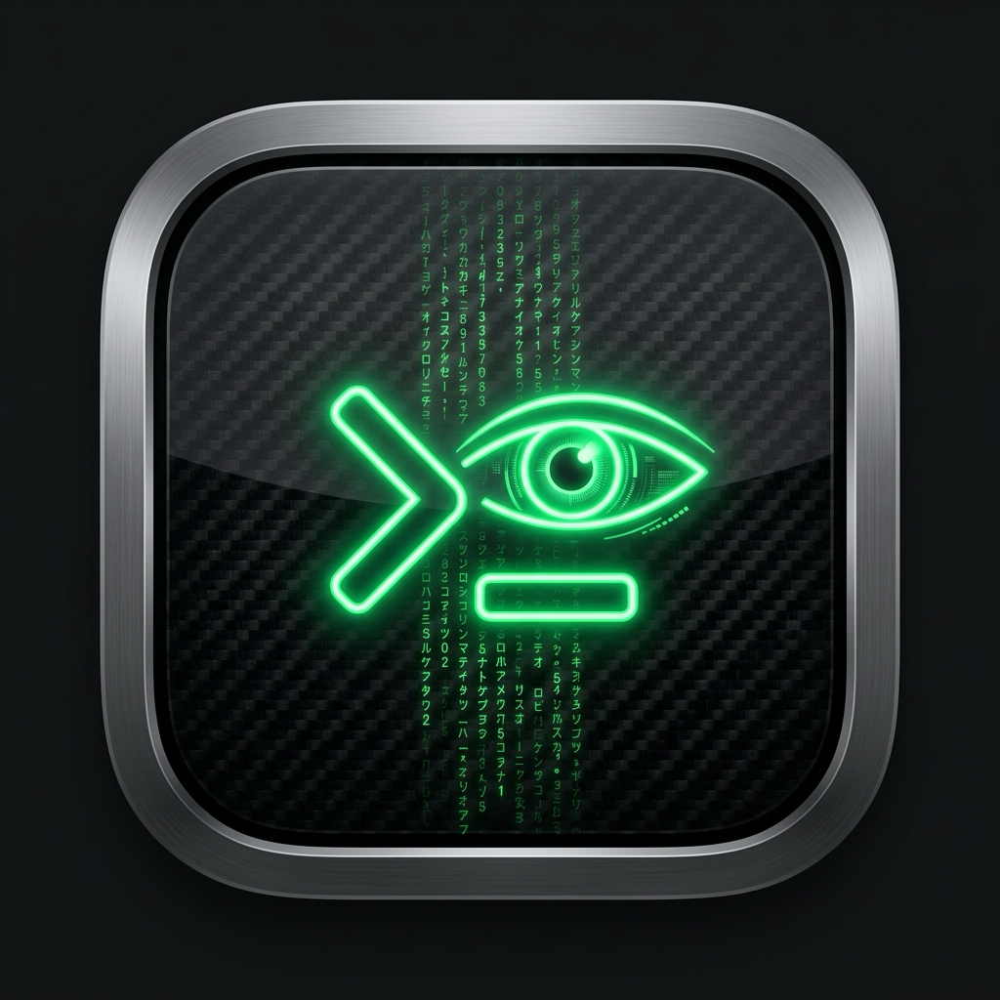
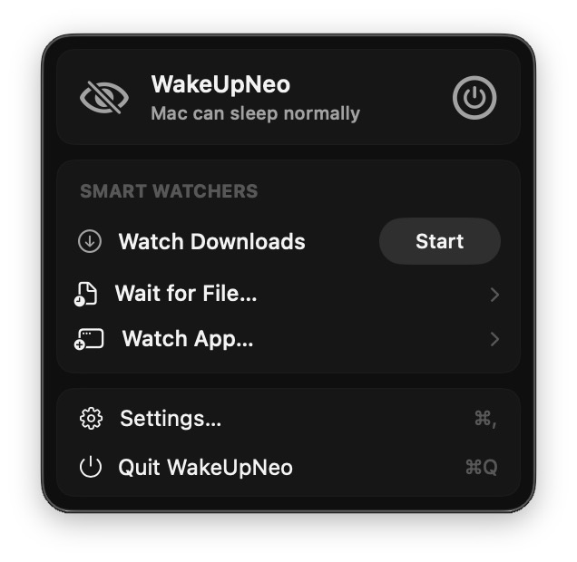
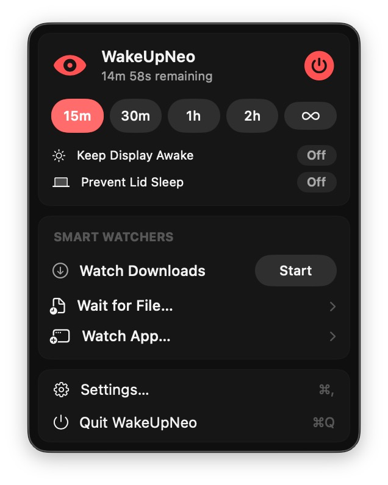
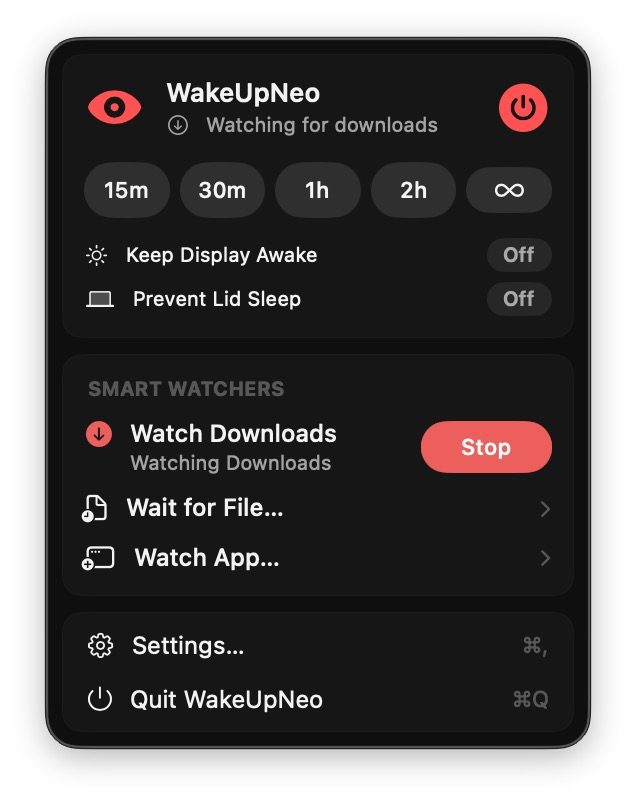
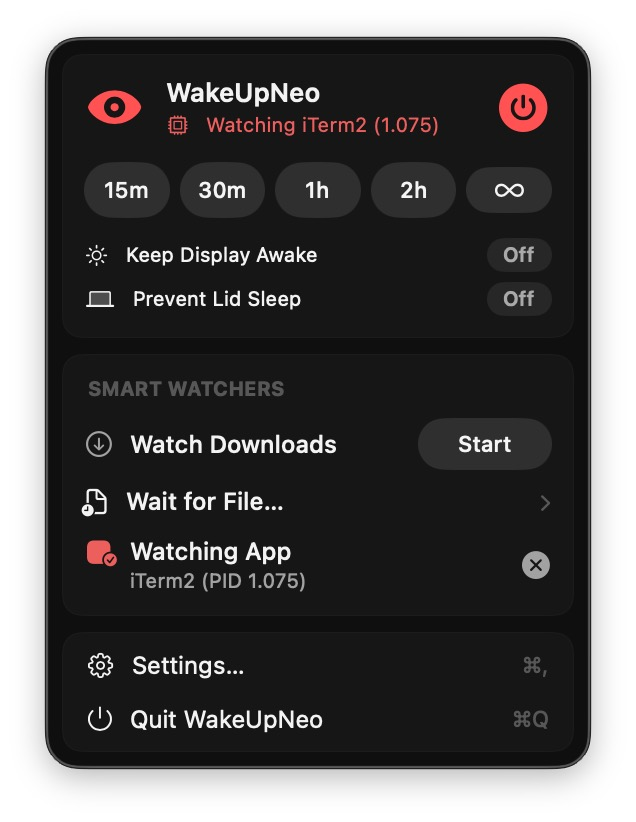

# WakeUpNeo

<div align="center">



### *Wake up, Neo. Stay awake. Stay out of the way.*

A sleek, lightweight, native macOS menu bar utility that prevents your Mac from sleeping during critical tasks. Built from scratch with Swift 6, SwiftUI, and first-party Apple APIs — zero third-party dependencies, zero telemetry, 100% offline.

[](https://reports.qualflare.com/p/wakeupneo/launches)
[](https://www.apple.com/macos/)
[](https://swift.org)
[](https://github.com/uysalserkan/WakeUpNeo/actions/workflows/ci.yml)
[](https://github.com/uysalserkan/WakeUpNeo/releases)
[](TEST_READY.md)
[](#architecture)
[](LICENSE)

[**Quick Start**](#-quick-start) •
[**Interface Preview**](#-interface-preview) •
[**Features**](#-features) •
[**User Guide**](#-user-guide) •
[**Smart Watchers**](#-smart-watchers) •
[**Settings**](#-settings--customization) •
[**Architecture**](#-architecture) •
[**FAQ**](#-faq--troubleshooting)

</div>

---

## 🖥️ Interface Preview

<div align="center">

| Idle Mode | Timed Session (15m) | Watch Downloads | Watch Application |
| :---: | :---: | :---: | :---: |
|  |  |  |  |
| *Mac can sleep normally* | *Live remaining countdown* | *Auto-sleeps on download finish* | *Keeps awake while app runs* |

</div>

---

## ⚡️ Why WakeUpNeo?

Have you ever started a large download, long build, or video render, stepped away, and returned to find your Mac went to sleep and halted everything? 

**WakeUpNeo** solves this gracefully:
- 🚀 **100% Native & Clean**: Pure SwiftUI and Apple `IOKit` / `ProcessInfo` power assertions. No Electron bloat, no background telemetry, no memory hogs.
- 🎯 **Menu Bar Only**: Seamlessly lives in your menu bar. No messy Dock icon, no `Cmd+Tab` clutter (`LSUIElement = YES`).
- 📥 **Smart Watchers**: Automatically detects active browser downloads (`.crdownload`, `.part`, `.download`, `.tmp`, etc.), monitors target export files, or watches running apps/processes.
- 🔋 **Granular Power Control**: Keep your system awake while letting the screen sleep to save battery and display life, or enable clamshell protection when the laptop lid is closed.
- ⏱️ **Drift-Proof Timers**: Computed directly from system clock deadlines — never loses seconds across sleep cycles.

---

## 🚀 Quick Start

### Installation

#### Option 1: Homebrew (Recommended)

Install WakeUpNeo via Homebrew Cask:

```bash
brew install uysalserkan/tap/wakeupneo
```

Or tap the repository and install:

```bash
brew tap uysalserkan/tap
brew install --cask wakeupneo
```

To upgrade in the future:

```bash
brew upgrade --cask wakeupneo
```

#### Option 2: Direct Download (Pre-built Release)

1. Download the latest `WakeUpNeo-macOS.zip` from [GitHub Releases](https://github.com/uysalserkan/WakeUpNeo/releases/latest).
2. Unzip and drag `WakeUpNeo.app` into your `/Applications` folder.
3. Launch WakeUpNeo — it will appear directly in your top menu bar!

#### Option 3: One-Command Build & Install from Source (Recommended for Developers)

Clone the repository and install directly to `/Applications/WakeUpNeo.app`:

```bash
git clone https://github.com/uysalserkan/WakeUpNeo.git
cd WakeUpNeo
make install
```

This compiles the release binary, creates the `.app` bundle, attaches the native app icon and metadata, code-signs with an ad-hoc signature, and places it in your `/Applications` folder.

#### Option 4: Swift Package Manager (Build from Source)

```bash
git clone https://github.com/uysalserkan/WakeUpNeo.git
cd WakeUpNeo
swift build -c release
```

The compiled binary will be located in `.build/release/WakeUpNeo`.

#### Option 5: Open in Xcode

```bash
open Package.swift
```

Select the **WakeUpNeo** executable scheme and hit **Product → Run** (`Cmd + R`).

---

## ✨ Features

| Feature | Description |
|---|---|
| 👁️ **Visual Menu Bar Status** | Clear state indicator: subtle eye icon when inactive, vibrant accent color with countdown when active. |
| ⚡️ **One-Click Indefinite Mode** | Toggle sleep prevention on/off with a single click. Holds assertion until manually stopped. |
| ⏱️ **Preset Timed Sessions** | Quick presets for **15m**, **30m**, **1h**, **2h**, **4h**, **8h**, or start indefinitely. |
| 📥 **Active Downloads Watcher** | Keeps Mac awake while files are downloading in Chrome, Safari, Firefox, Opera, Brave, Aria2, etc. Automatically lets Mac sleep when downloads complete. |
| 📱 **App & Process Watcher** | Monitors any active application or specific PID. Prevents sleep as long as that app/process remains running. |
| 📄 **Target File Settle Watcher** | Select a specific target file (e.g. video export, tarball, archive). Mac stays awake until the file finishes writing and stabilizes. |
| 💻 **Independent Power Assertions** | Independent toggles for **System Sleep**, **Display Sleep**, and **Lid-Close Sleep**. |
| 🔔 **Native macOS Notifications** | Gentle alerts when sessions expire, downloads finish, or watched files complete. |
| 🚀 **Launch at Login** | Seamless startup registration using modern macOS `ServiceManagement` (`SMAppService`). |
| ♿️ **Accessibility & Themes** | Full VoiceOver support, SF Symbols, and dynamic adaptation to macOS Light and Dark appearance. |

---

## 📖 User Guide

### 1. Starting Sleep Prevention

Click the **WakeUpNeo** eye icon in your top menu bar:
- **Instant Indefinite Mode**: Toggle the power button on the top right.
- **Quick Preset**: Click any duration pill (**15m**, **30m**, **1h**, **2h**, **∞**) to begin a timed session.
- **Stop**: Click the power button or the active preset button to stop anytime.

<div align="center">

| Idle / Normal State | Timed Session Active (15m) |
| :---: | :---: |
| <br><sub><em>Idle popover with Smart Watchers</em></sub> | <br><sub><em>Active session with live countdown & power toggles</em></sub> |

</div>

### 2. Power Settings Explained

WakeUpNeo gives you granular, independent control over macOS power management:

- 🖥️ **Prevent System Sleep** *(Default: ON)*: Prevents the CPU, network, and background tasks from sleeping.
- ☀️ **Keep Display Awake** *(Default: OFF)*: Keeps the display on. Keep this OFF if you want to turn off the monitor or let the screen dim while background tasks run.
- 💻 **Prevent Lid Sleep** *(Default: OFF)*: Keeps your MacBook awake even with the lid shut (clamshell mode without requiring an external monitor or power adapter).

---

## 📥 Smart Watchers

### Watch Downloads (Automatic Completion)

<p align="center">
  
</p>

When downloading large files, games, OS images, or media, you don't need to guess how long it will take:

1. Click the menu bar icon and click **Start** on **Watch Downloads**.
2. WakeUpNeo immediately inspects your `~/Downloads` folder for in-progress download extensions:
   - Chrome / Chromium: `.crdownload`
   - Safari: `.download` package bundles
   - Firefox: `.part`
   - General & Torrent Clients: `.tmp`, `.partial`, `.aria2`, `.!ut`, `.utpart`
   - Custom extensions defined in your Preferences
3. The menu bar displays the active state in real time (`Watching for downloads`).
4. Once all downloads finish and rename to their final formats, WakeUpNeo automatically releases all power assertions, posts a notification, and allows your Mac to sleep peacefully!

### Watch App / Process (Application Lifecycle)

<p align="center">
  
</p>

Keep your Mac awake dynamically while long-running jobs, terminal scripts, model training, or background rendering apps execute:

1. Click **Watch App…** from the Smart Watchers section.
2. Select any active running macOS application (e.g. `iTerm2`, `Xcode`, `Blender`, `HandBrake`) or enter a custom process ID (PID).
3. WakeUpNeo continuously monitors the process lifecycle without overhead.
4. As soon as the selected app or PID terminates, sleep prevention is automatically released.

### Wait for File (Export / Render Stabilization)

If you are rendering a 3D scene, compiling a huge project, or exporting a 4K video:

1. Click **Wait for File…** and choose your target output file or expected output path.
2. WakeUpNeo holds sleep prevention while the file is being created and written.
3. Once the file stops growing and its modification timestamp stabilizes (configurable settle period, default 2.0s), WakeUpNeo marks it complete, sends a notification, and re-enables sleep.

---

## ⚙️ Settings & Customization

Open Settings from the menu bar or press `Cmd + ,` to customize WakeUpNeo:

### 🛠️ General Tab
- **Launch at Login**: Automatically start WakeUpNeo silently when you log into macOS.
- **Show Countdown in Menu Bar**: Display the live remaining time directly in the menu bar beside the eye icon.
- **Notifications**: Enable/disable alerts when a session ends or 5 minutes before expiration.
- **Default Duration**: Pick your default session duration (15m to 8h, or Indefinite).

### 📥 Monitoring Tab
- **Downloads Folder**: Change the watched directory (defaults to `~/Downloads`).
- **Target File Stabilization**: Configure the quiet settle duration (0.5s to 30.0s).
- **Temporary File Extensions**: Add custom comma-separated extensions (e.g. `myext, inprogress`).
- **Completion Notifications**: Toggle alerts for download and target file completions.

### 🔋 Power Tab
- Configure default assertion behaviors for system sleep, display sleep, and laptop lid closure.

### ℹ️ About Tab
- Version info, build numbers, and project details.

---

## 🏗️ Architecture

WakeUpNeo is structured into decoupled, modular Swift targets adhering to strict concurrency and clean architecture principles:

```
Sources/
├── WakeUpNeoCore/                  # Pure domain & infrastructure (No SwiftUI)
│   ├── Infrastructure/
│   │   ├── PowerAssertion.swift    # IOKit IOPMAssertion RAII wrapper
│   │   └── SleepManager.swift      # Central @Observable @MainActor coordinator
│   ├── Models/
│   │   ├── AppSettings.swift       # Preferences & UserDefaults persistence
│   │   └── SleepMode.swift         # State machine (.off, .indefinite, .timed, .watchingDownloads, .waitingForFile)
│   └── Services/
│       ├── AppLogger.swift         # Unified OSLog subsystem (com.wakeupneo.app)
│       ├── DefaultFileWatcherService.swift  # DispatchSource + Polling file monitor
│       ├── DownloadPatternMatcher.swift     # High-performance extension classifier
│       ├── FileStabilityChecker.swift       # Timestamp & size stabilization algorithm
│       ├── FileWatchingService.swift        # Protocol contracts & Sendable state types
│       ├── LaunchAtLoginService.swift       # SMAppService integration
│       ├── NotificationService.swift       # UNUserNotificationCenter alerts
│       └── SleepPreventionService.swift     # IOKit & ProcessInfo implementations
│
└── WakeUpNeo/                      # Native SwiftUI application shell
    ├── App/
    │   ├── WakeUpNeoApp.swift      # @main MenuBarExtra & Settings scenes
    │   └── AppEnvironment.swift    # App-level dependency container
    ├── Features/
    │   ├── MenuBar/
    │   │   ├── MenuBarView.swift   # Main popover interface
    │   │   ├── MenuBarIcon.swift   # Menu bar status icon
    │   │   └── CountdownView.swift # Real-time drift-free countdown
    │   └── Settings/
    │       ├── SettingsView.swift  # TabView settings window
    │       ├── GeneralSettingsView.swift
    │       ├── MonitoringSettingsView.swift
    │       ├── PowerSettingsView.swift
    │       └── AboutView.swift
    └── Resources/
        ├── AppIcon.icns            # macOS native application icon
        ├── WakeUpNeo-Info.plist    # LSUIElement=YES (hides Dock & Cmd+Tab)
        └── WakeUpNeo.entitlements  # Sandboxing & power entitlements
```

---

## 🧪 Testing & Verification

WakeUpNeo features a **4-Tier Test Suite** with **203 automated tests** ensuring 100% reliability, zero memory leaks, and strict concurrency safety:

```bash
# Run entire test suite
swift test
```

### Test Hierarchy Overview

| Tier | Focus | Suites | Tests |
|---|---|---|:---:|
| **Tier 1** | Unit & Core Logic | `DownloadPatternMatcherTests`, `FileStabilityCheckerTests`, `FileWatcherTests`, `SettingsTests`, `SleepManagerTests`, `TimerTests` | 63 |
| **Tier 2** | Boundary & Adversarial | `AdversarialFileStabilizationTests`, `AdversarialM1ChallengeTests`, `AdversarialM3SettingsChallengeTests` | 49 |
| **Tier 3** | Cross-Feature Lifecycle | `SleepManagerFileWatcherTests`, `AdversarialM2ChallengeTests`, `AdversarialM2TransitionsAndNotificationsTests`, `AdversarialM3ChallengeTests`, `UIIntegrationTests` | 84 |
| **Tier 4** | Real-World Scenarios | `Tier4RealWorldScenariosTests` (Chrome, Safari packages, multi-browser queues, build artifact stabilization) | 7 |
| **Total** | | **15 Test Suites** | **203 Passed** |

See [TEST_READY.md](TEST_READY.md) and [TEST_INFRA.md](TEST_INFRA.md) for full test reports and architectural details.

---

## ❓ FAQ & Troubleshooting

<details>
<summary><b>Will my MacBook overheat if I keep it awake with the lid closed?</b></summary>
<br>
Modern Apple Silicon Macs (M1/M2/M3/M4) are exceptionally power-efficient. However, running heavy compute tasks (like 3D rendering or 100% CPU loads) inside a closed sleeve or backpack without airflow can cause thermal throttling. We recommend only using lid-close prevention when your MacBook is on a desk or has adequate ventilation.
</details>

<details>
<summary><b>How is WakeUpNeo different from Amphetamine or Caffeine?</b></summary>
<br>
WakeUpNeo is engineered from the ground up for modern macOS (Swift 6 & SwiftUI), completely open-source, with zero third-party dependencies or legacy hacks. It introduces <b>Smart Watchers</b> that dynamically monitor active downloads and target files, releasing sleep assertions automatically when finished so you never waste battery accidentally leaving sleep prevention on.
</details>

<details>
<summary><b>Does WakeUpNeo collect any data?</b></summary>
<br>
<b>Zero.</b> WakeUpNeo does not connect to the internet, does not use analytics, does not track telemetry, and stores all user preferences locally in your macOS standard <code>UserDefaults</code>.
</details>

<details>
<summary><b>How do I uninstall WakeUpNeo?</b></summary>
<br>
Simply quit the app from the menu bar (<code>⌘Q</code>) and drag <code>WakeUpNeo.app</code> from your <code>/Applications</code> folder to the Trash. To remove local preferences:
<pre><code>defaults delete com.wakeupneo.app</code></pre>
</details>

---

## 🤝 Contributing

Contributions are welcome! Please check out [CONTRIBUTING.md](CONTRIBUTING.md) for guidelines on code standards, Swift 6 strict concurrency, and how to run tests.

---

## 📄 License

WakeUpNeo is open-source software licensed under the **[MIT License](LICENSE)**.
